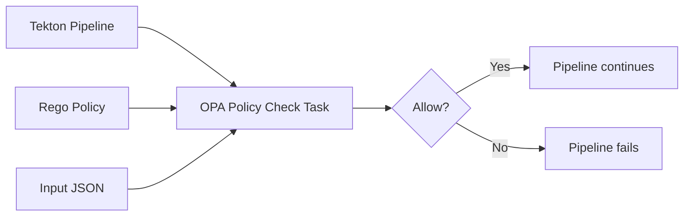

# A Reference Pattern for Policy Enforcement in CI/CD

This repository provides a minimal and reusable way to enforce **policy-as-code**
in **Tekton CI/CD pipelines** using **Open Policy Agent (OPA)**.

The intent is explicit and deliberate:

**enforce governance and compliance at build time, not after deployment.**

---

## Why this exists

Many CI/CD pipelines rely on:
- conventions instead of enforcement
- ad-hoc scripts
- duplicated security logic

This leads to:
- inconsistent governance
- weak auditability
- late detection of violations

This repository provides:
- a **generic Tekton Task** for policy evaluation
- **explicit Rego policies**
- a **clear and auditable contract** between pipeline and policy

---

## Architecture overview



**Flow:**
1. A Tekton pipeline executes
2. Policy and input data are provided via a workspace
3. The `opa-policy-check` task runs `opa eval`
4. A deny decision fails the pipeline immediately

This is **CI/CD governance**, not runtime admission control.

---

## Design principles

### Explicit over implicit
Policies do not infer facts.  
Evidence must be provided explicitly by the pipeline.

### Fail fast
Policy violations stop the pipeline immediately.  
No warnings. No best-effort behavior.

### Reusable building blocks
- one generic Tekton Task
- many small, focused policies

### Platform-agnostic
Works on:
- OpenShift
- vanilla Kubernetes
- any Tekton-based CI/CD platform

---

## Governance context

This pattern is suitable for:
- regulated environments
- public sector and critical infrastructure
- software supply chain governance

Typical policies include:
- SBOM required
- base image allow-lists
- prohibited licenses
- mandatory security scans
- provenance checks

Policies are:
- version-controlled
- reviewable
- testable
- auditable

---

## Repository structure

```
opa-tekton-policies/
├── tekton/        # Reusable Tekton Task(s)
├── policies/      # Rego policy examples
├── examples/      # Example inputs and pipelines
└── README.md
```

---

## Usage instructions

### 1. Add the OPA policy check task

Apply the Tekton Task once to your cluster:

```
kubectl apply -f tekton/opa-policy-check-task.yaml
```

This registers a reusable task named `opa-policy-check`.

---

### 2. Provide policy and input via a workspace

Your pipeline workspace must contain:
- a Rego policy file
- an input JSON file

Example structure:

```
workspace/
├── policies/
│   └── sbom-required.rego
└── examples/
    └── input.json
```

The task does **not** generate input data.  
The pipeline is responsible for providing explicit evidence.

---

### 3. Reference the task from a Tekton pipeline

Example:

```
tasks:
  - name: opa-policy-check
    taskRef:
      name: opa-policy-check
    workspaces:
      - name: source
        workspace: shared-workspace
    params:
      - name: policy
        value: policies/sbom-required.rego
      - name: input
        value: examples/input.json
      - name: query
        value: data.cicd.allow
```

---

### 4. Policy decision behavior

- Policy evaluates to `true` → pipeline continues
- Policy evaluates to `false` → pipeline fails immediately

The task relies on the OPA CLI exit behavior.

---

### 5. Writing policies

Policies must expose a boolean decision at the query path
used by the task.

Example (`sbom-required.rego`):

```
package cicd

default allow = false

allow {
  input.sbom.generated == true
}
```

The policy contract is intentionally simple and explicit.

---

### 6. Responsibility model

| Concern            | Responsibility |
|--------------------|----------------|
| Generating SBOM    | Pipeline       |
| Providing evidence | Pipeline       |
| Policy logic       | Rego           |
| Enforcement        | Tekton task    |
| Decision outcome   | OPA            |

This separation is deliberate and auditable.

---

## Notes for regulated environments

- Policies are version-controlled
- Decisions are deterministic
- No runtime dependencies are introduced
- Failures are explicit and traceable

This makes the pattern suitable for regulated CI/CD pipelines.

---

## What this repository is not

- Not a full CI/CD framework
- Not a policy management platform
- Not a replacement for admission controllers

It is intentionally **small and composable**.

---

## Future direction

Possible next steps (intentionally not implemented yet):
- policy bundles
- structured task results
- Tekton Catalog contribution
- reference architectures for regulated CI/CD

Only changes that preserve simplicity and auditability
will be considered.

---

## License

To be determined.  
Apache-2.0 is the likely choice.

---

## Status

This repository is intentionally small and opinionated.  
It serves as a **reference implementation**, not a product.